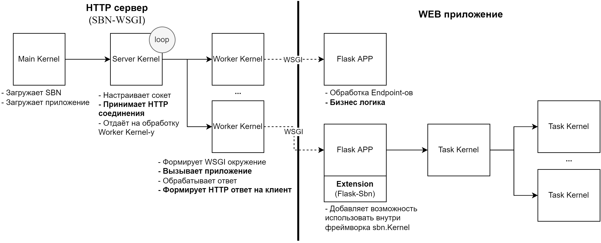

# WEB-SBN-Python
Стек технологий, включающий HTTP-сервер и Python-библиотеку, для возможности использования SBN-Python, как основы для построения распределенного WEB-приложения

> [SBN-Python](https://github.com/igankevich/subordination/wiki/SBN-Python) - это высокоуровневый интерфейс для framework-а [`Subordination`](https://github.com/igankevich/subordination), выполненный как расширение интерпретатора Python.
